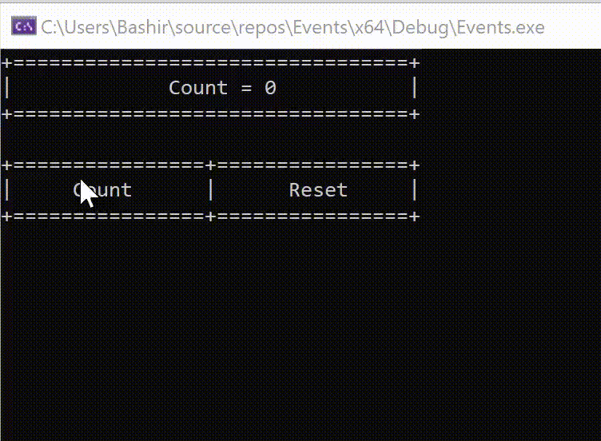

# Event-Driven-Cpp



**Console-Based Counter with Event-Driven Buttons**
This project demonstrates a simple console-based counter application with an event-driven approach to handling button clicks. The main objective is to provide hands-on experience with event listeners in C++ by simulating interactive "Count" and "Reset" buttons within a console window. The project utilizes Windows API for mouse-click detection and centers around three main classes: `Counter`, `Button`, and `Event`.

### Key Components

1. **Event Class**:
   - The `Event` class is designed to manage event listeners, allowing multiple functions to be triggered in response to an event.
   - With `addListener()`, each `Event` can store multiple listeners, and `trigger()` activates all listeners, simulating an event-driven model.
   - This class helps modularize the code, making it easy to add or modify functionality associated with button clicks.

2. **Button Class**:
   - The `Button` class represents a clickable region in the console, specified by its top-left and bottom-right coordinates.
   - Each button has its own `Event` instance to manage click-related actions through listeners.
   - `isInside()` checks if a point (mouse click) falls within the button's area, and `OnClick()` activates the button’s associated event listeners, simulating a click action.
   - Two button instances are created in the main program: one for "Count" and another for "Reset".

3. **Counter Class**:
   - The `Counter` class encapsulates the counter's value and provides methods to increase or reset it.
   - `displayDialog()` clears the console and redraws the interface, displaying the current count along with the "Count" and "Reset" button labels.
   - This class keeps the UI updated with the current counter state after each button click.

### Functionality

1. **Counter Interface**:
   - The program displays the counter value and button labels in a console layout that is redrawn each time a button is clicked.
   - The display is formatted using `setw` to align elements, making it visually structured.

2. **Event-Driven Button Click Handling**:
   - In the main loop, the program continuously monitors the mouse position and right-click state.
   - When the user right-clicks within the "Count" or "Reset" button area, the appropriate button's event listeners are triggered.
   - If "Count" is clicked, the counter increments, and if "Reset" is clicked, the counter resets to zero. Both actions refresh the display.

3. **Windows API Integration**:
   - The program uses `GetCursorPos()` to retrieve the mouse position in screen coordinates and `GetAsyncKeyState()` to check for right-clicks.
   - A debounce mechanism (`Sleep(300)`) prevents repeated triggers from a single click.

### Learning Objectives

- **Event-Driven Programming**: This project illustrates how to implement an event-driven model in C++ by associating specific actions with button clicks.
- **Encapsulation**: Separating logic into `Counter`, `Button`, and `Event` classes provides a clean, modular structure.
- **Mouse Interaction in Console Applications**: By leveraging Windows API, the project demonstrates how to detect and handle mouse events in a console application.
  
### Sample Console Output

The interface displays as follows:

```
+=================================+
|           Count = 5            |
+=================================+

+================+================+
|     Count      |      Reset     |
+================+================+
```

This project is ideal for those looking to deepen their understanding of event handling.